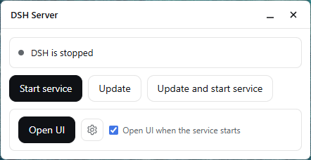
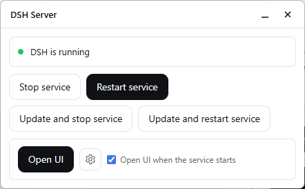
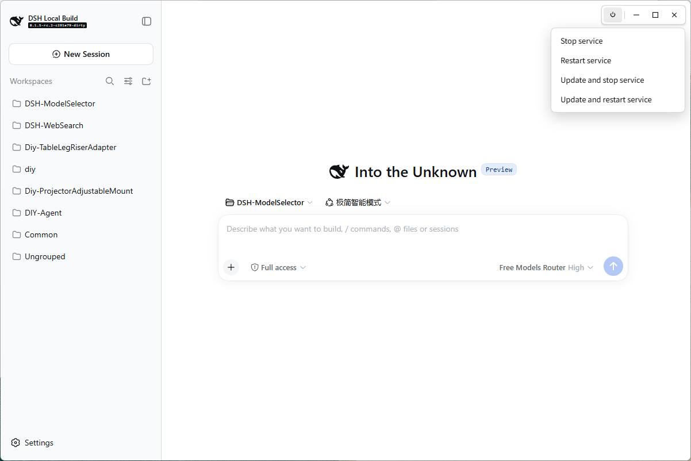

# dsh-rebooter

**English** · [简体中文](README.zh.md)

A lightweight [DeepSeek Harness](https://github.com/deepseek-ai/deepseek-harness) plugin for **start service / stop service / restart service / update plugins / update DSH / open**. The default web UI is its own window and does not need a browser. The page window's power button opens the **plugin** lifecycle menu; one desktop entry **DSH Server** for the status panel. Plugin update stops DSH first, then upgrades **every plugin** in the current profile. Updating DSH itself is a separate panel / CLI action family.

Plugin conventions: [`docs/dsh-plugin-spec.md`](docs/dsh-plugin-spec.md). Design notes: [`docs/design-notes.md`](docs/design-notes.md). Status panel: [`docs/status-panel.md`](docs/status-panel.md).

## How to use

**A lightweight plugin. The default web UI is its own window and does not need a browser.** Open does not launch Chrome, Edge, or another browser. A program bound with the gear still opens instead. Double-click **DSH Server** on the desktop to open the panel, which is the same kind of window. The pictures show the Chinese labels.

**Both windows are only a display shell.** Closing or minimizing them does not stop a running service or the supervisor. To stop, use Stop service or Update plugins and stop. The window's own close button only closes that window.

The separate window needs the OS web component: WebView2 on Windows, the built-in WebKit on macOS, and WebKitGTK on Linux. If that component is missing, or the window cannot be created, the plugin does not install it. DSH Server and the DSH page then open with the system default program, usually the browser. In the browser there is no top-right button group, blank areas cannot drag the window, and Browse on the panel cannot pick a file — type the path. Start, stop, restart, update plugins, update DSH, language, and theme still work.


Double-click this icon to open the panel. It is created only the first time this plugin starts with DSH. If you delete it, the next start does not put it back. Use **Put on Desktop** on the panel, or the desktop command in Install. Without the icon, the panel command in Install still opens it.



Stopped: start; Plugins: update plugins / update plugins and start; DSH: update DSH / update DSH and start. If "open the page when the service starts" is checked, the next start also opens the page.



Running: stop / restart; Plugins: update plugins and stop / update plugins and restart; DSH: update DSH and stop / update DSH and restart; open the page. The gear binds another program; after that, Open opens that program.



The picture above is that separate window, not a browser tab. Hover the top-right corner for power / minimize / maximize / close. Power opens the four **plugin** items (no Start, no Update DSH). Close only closes this window. On Windows, drag the top blank band for Aero Snap; double-click it to maximize/restore like the button.

## What it does

| Action | Menu | Panel / CLI |
| --- | --- | --- |
| `start` | no | yes |
| `stop` | yes | yes |
| `restart` | yes | yes |
| `update` | no | yes (when stopped) |
| `update-stop` | yes | yes |
| `update-restart` | yes | yes |
| `update-dsh` | no | yes (when stopped) |
| `update-dsh-stop` | no | yes (when running) |
| `update-dsh-restart` | no | yes |
| `open` | no | yes (when running) |
| `panel` | — | opens **DSH Server** |

The four menu items open from the power button on the page window's control bar. Clicking one posts `/api/dsh-rebooter/action`. Start and Update DSH are not in that menu.

A detached Node supervisor keeps DSH alive after start: an unexpected host exit is relaunched until you `stop`. Starting the service no longer opens the browser unless **Open UI when the service starts** is checked in the panel (or you pass `--open`). Stopping the service also closes the page window. The window close button only closes that window.

On Windows, a console-less host would flash a console on every short tool spawn. When this plugin starts the host, it prepends `windows-hide-child.cjs` to `NODE_OPTIONS` so Node's `windowsHide` defaults on for those children. A terminal `dsh web` does not get that inject.

## Install

Anyone can install it from npm. Then restart `dsh web`.

```bash
dsh plugin --profile web add dsh-rebooter
```

The desktop shortcut is created the first time DSH starts. Open the panel anytime, or put the shortcut back on the Desktop:

```bash
npx --yes dsh-rebooter panel
```

```bash
npx --yes dsh-rebooter desktop
```

The panel button **Put on Desktop** does the same as the desktop command. Requires `Node 24` or newer. The panel window uses the OS web view: `WebView2` on Windows, system WebKit on macOS, `WebKitGTK` on Linux. If that runtime is missing, DSH Server and the DSH page open with the default URL handler. The panel follows the UI language (`zh` or `en`). Open UI opens that page in its own window. A bound program, if set, still opens instead.

Working on this repository keeps the local link. Build, then point the profile at `./package`. Do not install the npm copy over that link. Here, open the panel and put the shortcut back with the local commands, not `npx` (that runs the published package).

```bash
node build-rebooter.mjs
dsh plugin --profile web add ./package
```

```bash
node package/lib/cli.cjs panel
```

```bash
node package/lib/cli.cjs desktop
```

## Update / uninstall

After an npm install, update this plugin with `dsh plugin --profile web update dsh-rebooter`, then restart `dsh web`. In this repository, rebuild the linked package instead:

```bash
git pull && node build-rebooter.mjs
```

Uninstall: `dsh plugin --profile web remove dsh-rebooter`. State lives in `$DSH_HOME/rebooter/` and is left in place.

The in-app **Update plugins** actions run `dsh plugin --profile web update --latest`, which updates **every** installed plugin, not only this one. On failure they restore the profile `package.json` / lockfile snapshot and reinstall. **Update DSH** (`update-dsh*`) upgrades the harness install recorded in `layout.json` (git: pull --ff-only + pnpm install, and `build:lib:client` only when pull brought commits; or npm/pnpm for `@deepseek-ai/dsh`). It never touches profile plugin deps. If a mutating step fails, the install is rolled back to the pre-update state; `update-*-restart` still brings the service back up afterward.

## Publish a version

```bash
node publish-via-actions.mjs 1.0.1
```

That starts `publish.yml` on GitHub and waits until it finishes. Use a version higher than the one on npm. You can also open Actions and run `publish.yml` by hand.

Before the first run, add a Trusted Publisher on the npm package settings: user `IQzhan`, repository `dsh-rebooter`, workflow filename `publish.yml`, and allow a direct `npm publish`.

## Layout

| File | Role |
| --- | --- |
| `dsh-rebooter-core.js` | Pure policy: action names, ports, availability matrix, DSH classify/plan |
| `dsh-rebooter-runtime.js` | Node IO: state dir, supervisor, jobs, desktop entry, DSH recipes |
| `dsh-rebooter-panel.js` | Status panel HTTP + HTML |
| `dsh-rebooter.host.js` | Cordis adapter: records launch, HTTP, dispatches CLI |
| `dsh-rebooter.client.js` | No page UI; the menu is on the window bar |
| `dsh-rebooter-cli.js` | `start` / `stop` / `restart` / `update*` / `update-dsh*` / `open` / `panel` / `desktop` |
| `windows-hide-child.cjs` | Windows `NODE_OPTIONS` preload: default `windowsHide` on child spawns |
| `build-rebooter.mjs` | Builds `package/` |
| `docs/dsh-plugin-spec.md` | DSH plugin conventions |
| `docs/design-notes.md` | Why this plugin is shaped this way |
| `docs/status-panel.md` | DSH Server panel design |

## Tests

```bash
node verify.mjs
```

**8 suites, 262 assertions**: policy core · runtime · panel · adapter · package · menu · bilingual docs · portability guard.

Scratch files stay in-repo under `.tmp/`, never the system temp directory.

## License

[MIT](LICENSE)
