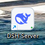
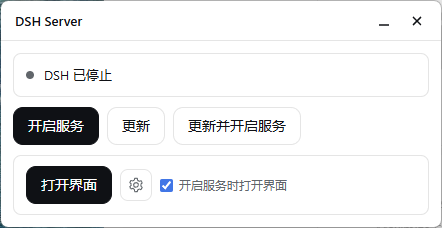
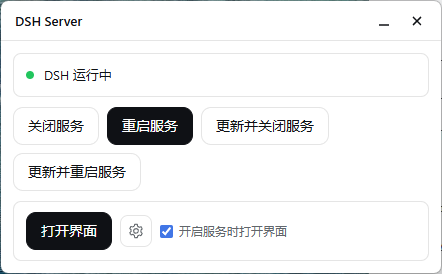
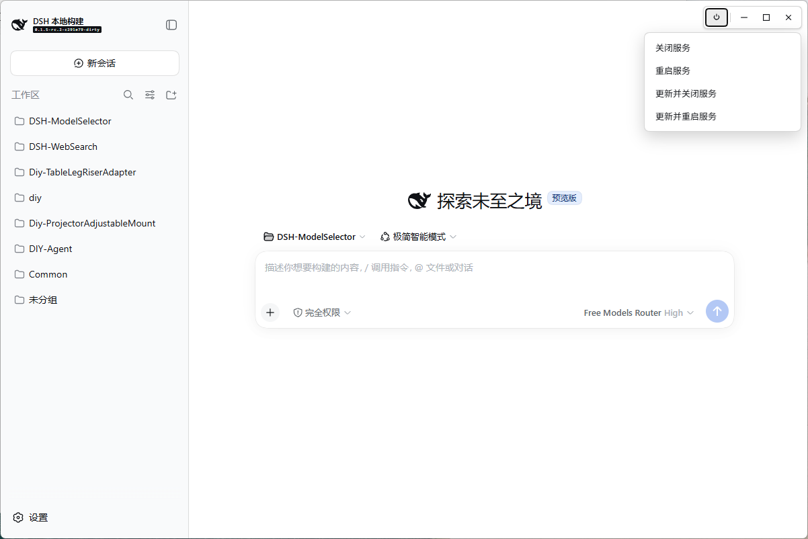

# dsh-rebooter

[English](README.md) · **简体中文**

为 [DeepSeek Harness](https://github.com/deepseek-ai/deepseek-harness) 提供一个轻量插件，用来**开启服务 / 关闭服务 / 重启服务 / 更新 / 打开界面**。默认打开的页面是独立窗口，不依赖浏览器。页面窗口操作栏的电源按钮弹出生命周期菜单；桌面一个 **DSH Server** 状态面板入口。更新会先关掉 DSH，再升级当前 profile 里的**全部插件**。

制作规范见 [`docs/dsh-plugin-spec.md`](docs/dsh-plugin-spec.md)；设计取舍见 [`docs/design-notes.md`](docs/design-notes.md)；状态面板见 [`docs/status-panel.md`](docs/status-panel.md)。

## 怎么用

**轻量插件。默认打开的页面是独立窗口，不依赖浏览器。** 点「打开界面」不会进 Chrome、Edge 或其他浏览器。只有在齿轮里绑定了别的程序，才会改开那个程序。桌面双击 **DSH Server**，打开的面板也是这种窗口。

**这两个窗口都只是展示壳。** 关掉或最小化，已经在跑的服务和监督进程不受影响。要停服务，用「关闭服务」或「更新并关闭服务」。窗口自己的关闭按钮只关窗口。

独立窗口靠系统里的网页组件：Windows 要有 WebView2，macOS 用自带的 WebKit，Linux 要有 WebKitGTK。没有这些组件，或窗口创建失败时，插件不会帮忙安装。这时 DSH Server 和 DSH 页面都改由系统默认程序打开，通常就是浏览器。浏览器里没有右上角按钮组，不能靠窗口空白处拖动，面板上的「浏览」也不能选文件，路径要自己填。开关、重启、更新、语言和主题都还在。



双击打开面板。图标只在这个插件第一次随 DSH 启动时创建。删掉之后，下次启动不会自动放回来。用面板上的「放到桌面」，或安装一节里的 desktop 命令再放一次。没有图标时，用安装一节里的 panel 命令打开面板。



未运行：开启服务、更新、更新并开启服务。勾选「开启服务时打开界面」后，下次开服务会一起打开页面。



运行中：关闭服务、重启服务、更新并关闭服务、更新并重启服务、打开界面。齿轮用来绑定别的程序；绑了之后，「打开界面」打开那个程序。



上图就是这个独立窗口，不是浏览器标签。进来时右上角是空的。把鼠标移到窗口最右上角、上边和右边交界的那个小角，按钮组才出现：电源、最小化、最大化、关闭。鼠标移开就藏回去。点电源，弹出上面四项；菜单里没有「开启服务」。最右边的关闭只关这个窗口。

## 它做什么

| 动作 | 菜单 | 面板 / CLI |
| --- | --- | --- |
| `start` | 否 | 是 |
| `stop` | 是 | 是 |
| `restart` | 是 | 是 |
| `update` | 否 | 是（未启动时） |
| `update-stop` | 是 | 是 |
| `update-restart` | 是 | 是 |
| `open` | 否 | 是（已启动时） |
| `panel` | — | 打开 **DSH Server** |

这四项从页面窗口操作栏的电源按钮弹出。点选后请求 `/api/dsh-rebooter/action`。菜单里没有开启服务。

开启服务后由独立的 Node 监督进程常驻：Web 宿主异常退出会拉起下一代，直到你主动 `stop`。开启服务**默认不再**打开浏览器，除非在面板勾选「开启服务时打开界面」（或 CLI 传 `--open`）。关闭服务时会一并关掉界面窗口。窗口上的关闭只关窗口，不停服务。

在 Windows 上，无控制台宿主每次短工具调用都会闪一下控制台。由本插件拉起宿主时，会把 `windows-hide-child.cjs` 前置进 `NODE_OPTIONS`，让子进程默认带上 Node 的 `windowsHide`。你在终端自己跑 `dsh web` 时不会注入。

## 安装

直接从 npm 安装，然后重启 `dsh web`。

```bash
dsh plugin --profile web add dsh-rebooter
```

桌面快捷方式只在第一次启动 DSH 时创建。随时打开面板，或把快捷方式放回桌面：

```bash
npx --yes dsh-rebooter panel
```

```bash
npx --yes dsh-rebooter desktop
```

面板上的「放到桌面」和 desktop 命令是同一件事。需要 `Node 24` 或更高版本。面板窗口使用系统网页组件：Windows 为 `WebView2`，macOS 为系统 WebKit，Linux 为 `WebKitGTK`。组件缺失时，DSH Server 和 DSH 页面改由系统默认方式打开。面板文案跟随界面语言（`zh` 或 `en`）。「打开界面」在独立窗口里打开这个页面。若已绑定程序，仍打开该程序。

在本仓库里开发，继续用本地链接，不要用 npm 上的包盖掉它。先构建，再把 profile 指到 `./package`。这里打开面板、放回快捷方式，用下面的本地命令，不要用 `npx`（那会跑已发布的包）。

```bash
node build-rebooter.mjs
dsh plugin --profile web add ./package
```

```bash
node package/lib/cli.cjs panel
```

```bash
node package/lib/cli.cjs desktop
```

## 更新 / 卸载

npm 安装之后，用 `dsh plugin --profile web update dsh-rebooter` 更新本插件，再重启 `dsh web`。在本仓库里改代码，则重新构建本地链接：

```bash
git pull && node build-rebooter.mjs
```

卸载：`dsh plugin --profile web remove dsh-rebooter`。状态在 `$DSH_HOME/rebooter/`，想留就留。

菜单里的「更新」跑的是 `dsh plugin --profile web update --latest`，会更新**所有**已装插件，不只是本包。

## 发布新版本

```bash
node publish-via-actions.mjs 1.0.1
```

这会在 GitHub 上启动 `publish.yml`，并等到跑完。版本号要比 npm 上的更高。也可以自己打开 Actions 手动跑 `publish.yml`。

第一次使用前，到 npm 这个包的设置里添加 Trusted Publisher：用户 `IQzhan`，仓库 `dsh-rebooter`，工作流文件名 `publish.yml`，并允许直接 `npm publish`。

## 目录结构

| 文件 | 作用 |
| --- | --- |
| `dsh-rebooter-core.js` | 纯策略：动作名、端口、可用性矩阵 |
| `dsh-rebooter-runtime.js` | Node IO：状态目录、监督进程、任务、桌面入口 |
| `dsh-rebooter-panel.js` | 状态面板 HTTP + HTML |
| `dsh-rebooter.host.js` | Cordis 适配：记录启动、HTTP、派出 CLI |
| `dsh-rebooter.client.js` | 不画页面；菜单在窗口操作栏 |
| `dsh-rebooter-cli.js` | `start` / `stop` / `restart` / `update*` / `open` / `panel` / `desktop` |
| `windows-hide-child.cjs` | Windows 下 `NODE_OPTIONS` 预加载：子进程默认 `windowsHide` |
| `build-rebooter.mjs` | 构建 `package/` |
| `docs/dsh-plugin-spec.md` | DSH 插件制作规范 |
| `docs/design-notes.md` | 本插件的设计说明 |
| `docs/status-panel.md` | DSH Server 面板设计 |

## 测试

```bash
node verify.mjs
```

**8 个套件、207 条断言**：策略核心 · 运行时 · 面板 · 适配层 · 包 · 菜单 · 文档双语同步 · 可移植性守卫。

测试临时文件写在仓库内 `.tmp/`，不写系统临时目录。

## 许可

[MIT](LICENSE)
